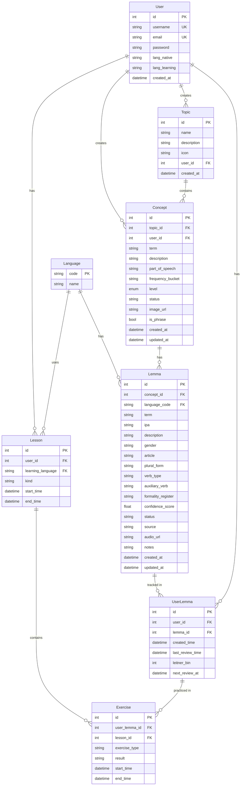

# Entity Relationship Diagram

```mermaid
erDiagram
    User ||--o{ UserLemma : "has"
    User ||--o{ Topic : "creates"
    User ||--o{ Concept : "creates"
    User ||--o{ Lesson : "has"
    
    Language ||--o{ Lemma : "has"
    Language ||--o{ Lesson : "uses"
    
    Topic ||--o{ Concept : "contains"
    
    Concept ||--o{ Lemma : "has"
    
    Lemma ||--o{ UserLemma : "tracked in"
    
    UserLemma ||--o{ Exercise : "practiced in"
    
    Lesson ||--o{ Exercise : "contains"
    
    User {
        int id PK
        string username UK
        string email UK
        string password
        string lang_native
        string lang_learning
        datetime created_at
    }
    
    Language {
        string code PK
        string name
    }
    
    Topic {
        int id PK
        string name
        string description
        string icon
        int user_id FK
        datetime created_at
    }
    
    Concept {
        int id PK
        int topic_id FK
        int user_id FK
        string term
        string description
        string part_of_speech
        string frequency_bucket
        enum level
        string status
        string image_url
        bool is_phrase
        datetime created_at
        datetime updated_at
    }
    
    Lemma {
        int id PK
        int concept_id FK
        string language_code FK
        string term
        string ipa
        string description
        string gender
        string article
        string plural_form
        string verb_type
        string auxiliary_verb
        string formality_register
        float confidence_score
        string status
        string source
        string audio_url
        string notes
        datetime created_at
        datetime updated_at
    }
    
    UserLemma {
        int id PK
        int user_id FK
        int lemma_id FK
        datetime created_time
        datetime last_review_time
        int leitner_bin
        datetime next_review_at
    }
    
    Exercise {
        int id PK
        int user_lemma_id FK
        int lesson_id FK
        string exercise_type
        string result
        datetime start_time
        datetime end_time
    }
    
    Lesson {
        int id PK
        int user_id FK
        string learning_language FK
        string kind
        datetime start_time
        datetime end_time
    }
```

