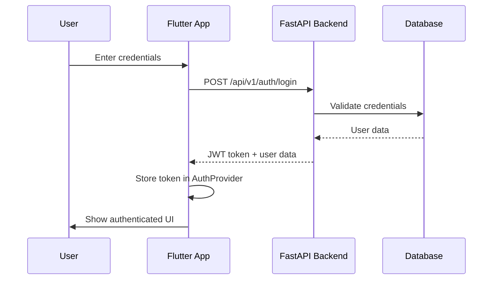
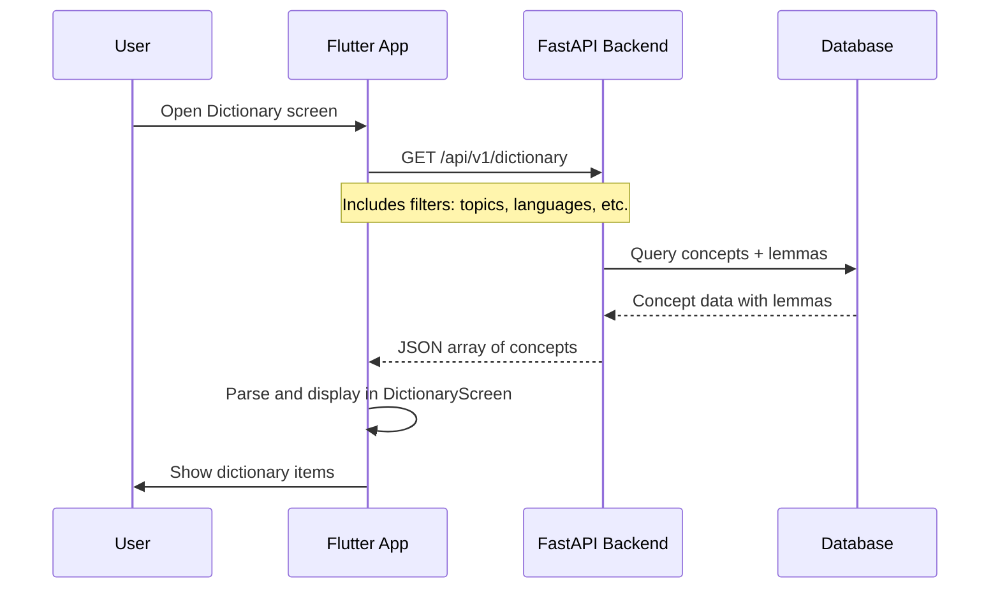
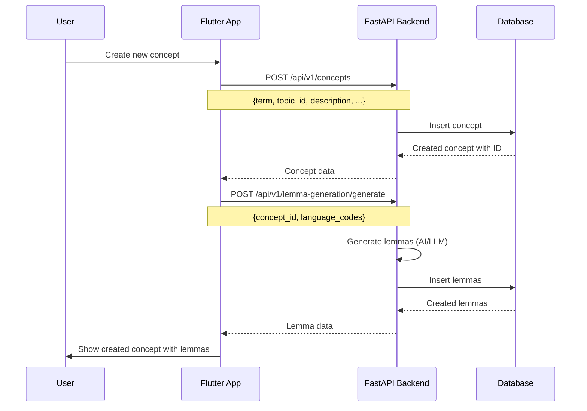
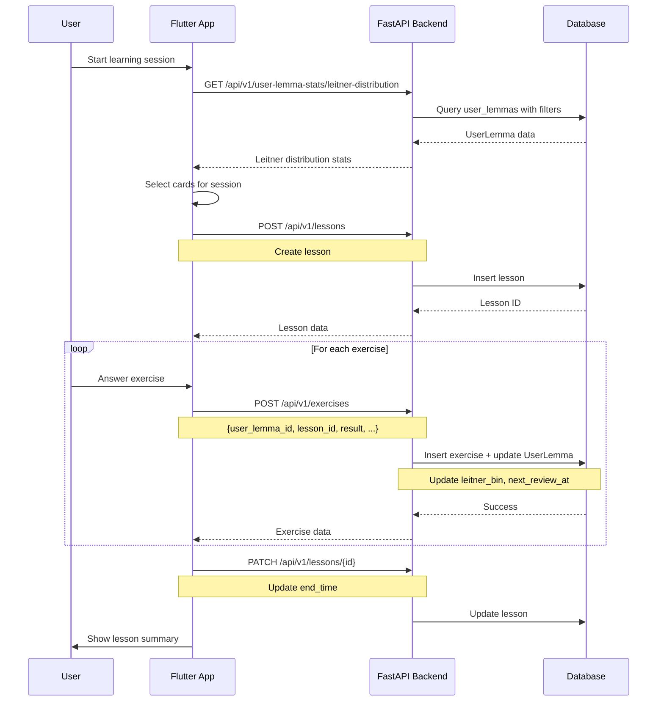
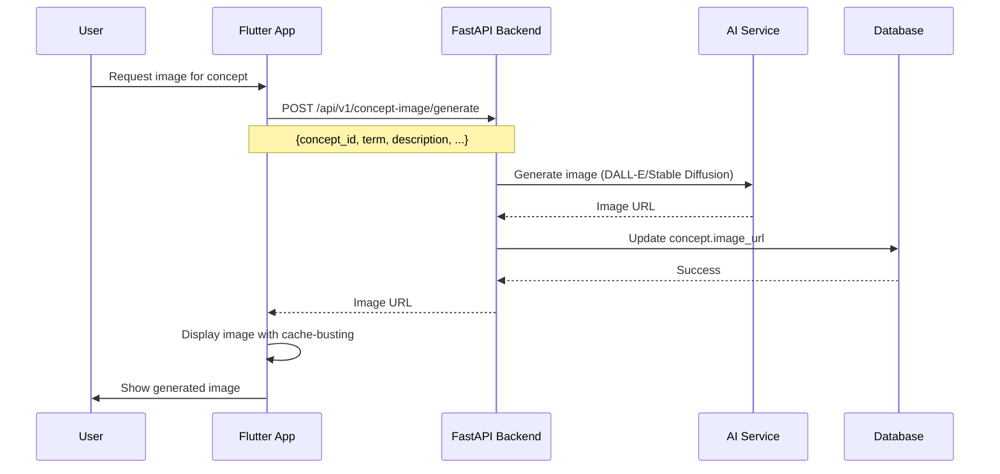
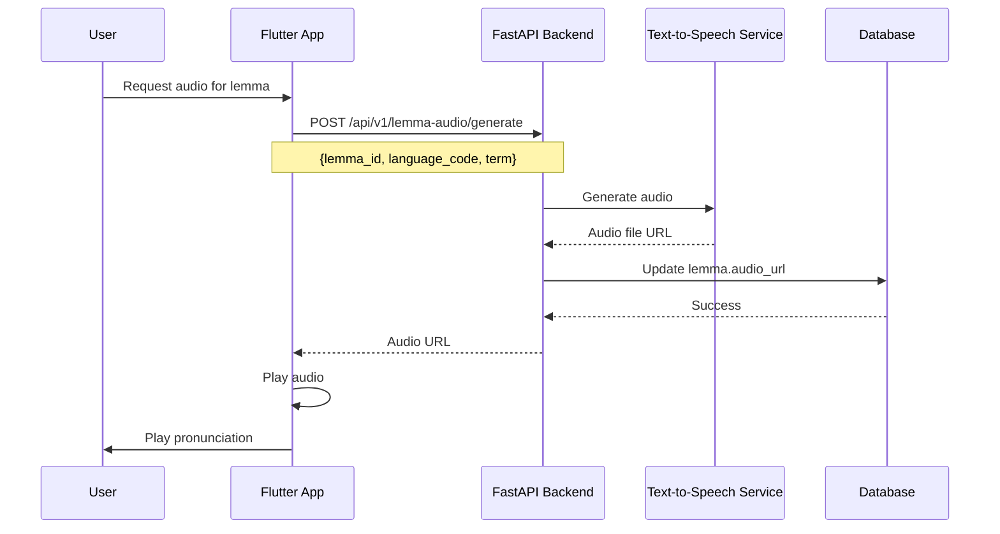

# API Flow Documentation

This document describes the flow of data and logic from the Flutter frontend to the FastAPI backend.

## Architecture Overview

```
┌─────────────────┐         HTTP/REST          ┌─────────────────┐
│  Flutter App    │ ─────────────────────────> │   FastAPI API   │
│  (Frontend)     │ <───────────────────────── │   (Backend)     │
└─────────────────┘         JSON Response      └─────────────────┘
```

## Common Flow Patterns

### 1. Authentication Flow



**Frontend**: `app/lib/src/features/profile/data/auth_service.dart`  
**Backend**: `api/app/api/v1/endpoints/auth.py`

### 2. Dictionary View Flow



**Frontend**: `app/lib/src/features/dictionary/presentation/screens/dictionary_screen.dart`  
**Backend**: `api/app/api/v1/endpoints/dictionary.py`

### 3. Concept Creation Flow



**Frontend**: `app/lib/src/features/create/presentation/screens/create_screen.dart`  
**Backend**: `api/app/api/v1/endpoints/concepts.py`, `lemma_generation.py`

### 4. Learning Session Flow



**Frontend**: `app/lib/src/features/learn/presentation/screens/learn_screen.dart`  
**Backend**: `api/app/api/v1/endpoints/lessons.py`, `user_lemma_stats.py`

### 5. Image Generation Flow



**Frontend**: `app/lib/src/common_widgets/concept_drawer/concept_image_widget.dart`  
**Backend**: `api/app/api/v1/endpoints/concept_image.py`

### 6. Audio Generation Flow



**Frontend**: `app/lib/src/common_widgets/lemma_audio_player.dart`  
**Backend**: `api/app/api/v1/endpoints/lemma_audio.py`

## API Endpoint Mapping

### Frontend Service → Backend Endpoint

| Frontend Service | Backend Endpoint | Purpose |
|----------------|------------------|---------|
| `AuthService` | `/api/v1/auth/login`<br>`/api/v1/auth/register` | Authentication |
| `DictionaryService` | `/api/v1/dictionary` | Get concepts with lemmas |
| `ConceptService` | `/api/v1/concepts` | CRUD operations on concepts |
| `LemmaService` | `/api/v1/lemmas` | CRUD operations on lemmas |
| `LemmaGenerationService` | `/api/v1/lemma-generation/generate` | Generate lemmas for concept |
| `ImageService` | `/api/v1/concept-image/generate` | Generate concept images |
| `LemmaAudioService` | `/api/v1/lemma-audio/generate` | Generate lemma audio |
| `TopicService` | `/api/v1/topics` | CRUD operations on topics |
| `LanguageService` | `/api/v1/languages` | Get supported languages |
| `LessonService` | `/api/v1/lessons` | Create/update lessons |
| `StatisticsService` | `/api/v1/user-lemma-stats/*` | Get user statistics |
| `FlashcardExportService` | `/api/v1/flashcard-export/*` | Export flashcards |

## Request/Response Patterns

### Standard Request Format
```dart
// Flutter
final response = await http.post(
  Uri.parse('${ApiConfig.apiBaseUrl}/endpoint'),
  headers: {
    'Content-Type': 'application/json',
    'Authorization': 'Bearer $token', // If authenticated
  },
  body: jsonEncode(requestBody),
);
```

### Standard Response Handling
```dart
if (response.statusCode == 200) {
  final data = jsonDecode(response.body) as Map<String, dynamic>;
  // Process data
} else {
  final error = jsonDecode(response.body) as Map<String, dynamic>;
  final errorMessage = error['detail'] as String? ?? 'Error occurred';
  // Handle error
}
```

### Error Response Format
```json
{
  "detail": "Error message",
  "type": "ErrorType"
}
```

## Data Flow Layers

1. **Presentation Layer** (Flutter)
   - Screens, widgets, controllers
   - User interaction handling
   - State management

2. **Service Layer** (Flutter)
   - HTTP client calls
   - Request/response parsing
   - Error handling

3. **API Layer** (FastAPI)
   - Endpoint definitions
   - Request validation (Pydantic schemas)
   - Authentication/authorization

4. **Service Layer** (Python)
   - Business logic
   - External service integration (AI, TTS, etc.)
   - Data transformation

5. **Model Layer** (SQLModel)
   - Database models
   - Relationships
   - Data persistence

6. **Database Layer** (PostgreSQL)
   - Data storage
   - Constraints and indexes

## Authentication

Most endpoints require authentication via JWT tokens. The token is obtained from `/api/v1/auth/login` and should be included in the `Authorization` header:

```
Authorization: Bearer <token>
```

## Filtering and Pagination

Many endpoints support filtering via query parameters:
- `topic_ids`: Filter by topic IDs
- `language_codes`: Filter by language codes
- `levels`: Filter by CEFR levels
- `part_of_speech`: Filter by part of speech
- `include_phrases`: Include/exclude phrases
- `include_lemmas`: Include/exclude lemmas

See individual endpoint documentation in the API docs (`/docs`) for specific filter options.

